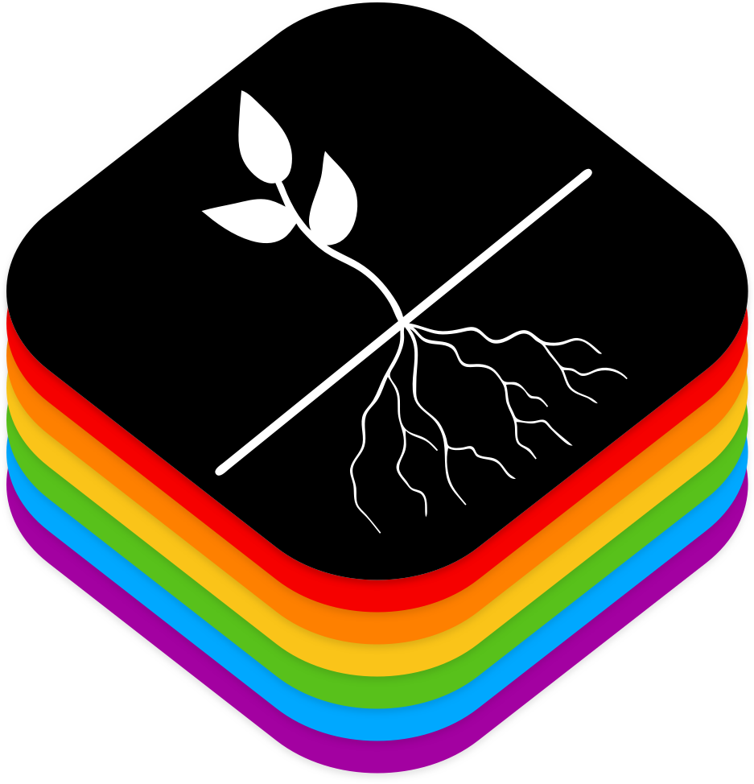

# **`(मूल:)` Mool** 
-------

#### Extra Foundation Framework for your app

`🏳️‍🌈`Proudly supporting LGBTQ+ community   
`🏴`Black Lives Matter 

 

  

In `Sanskrit(संस्कृतम्)`, `Mool(मूल:)` translated as original or prime. This repo consists of extensions and classes that can help any developer to bootstrap a new project very easily and quickly.

**Documentation** 
[https://mtaden.github.io/mool/](https://mtaden.github.io/mool/)

**Todo**:  
✅ Framework icon  
✅ Creating Framework icon supporting `Black Lives Matter` 
✅ Creting Example project in framework  
❌ Adding content to example project.  
✅ Add documentation through Jazzy  
❌ Adding content to example project.  

-------------------------------------------

<!-- All visible code above this line -->
<!-- invisible tracking pixel from segment.io -->

<!-- end here --> 
